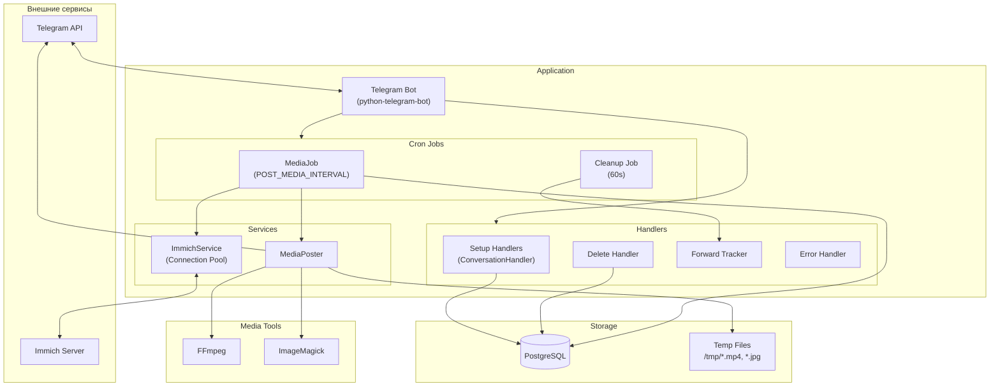
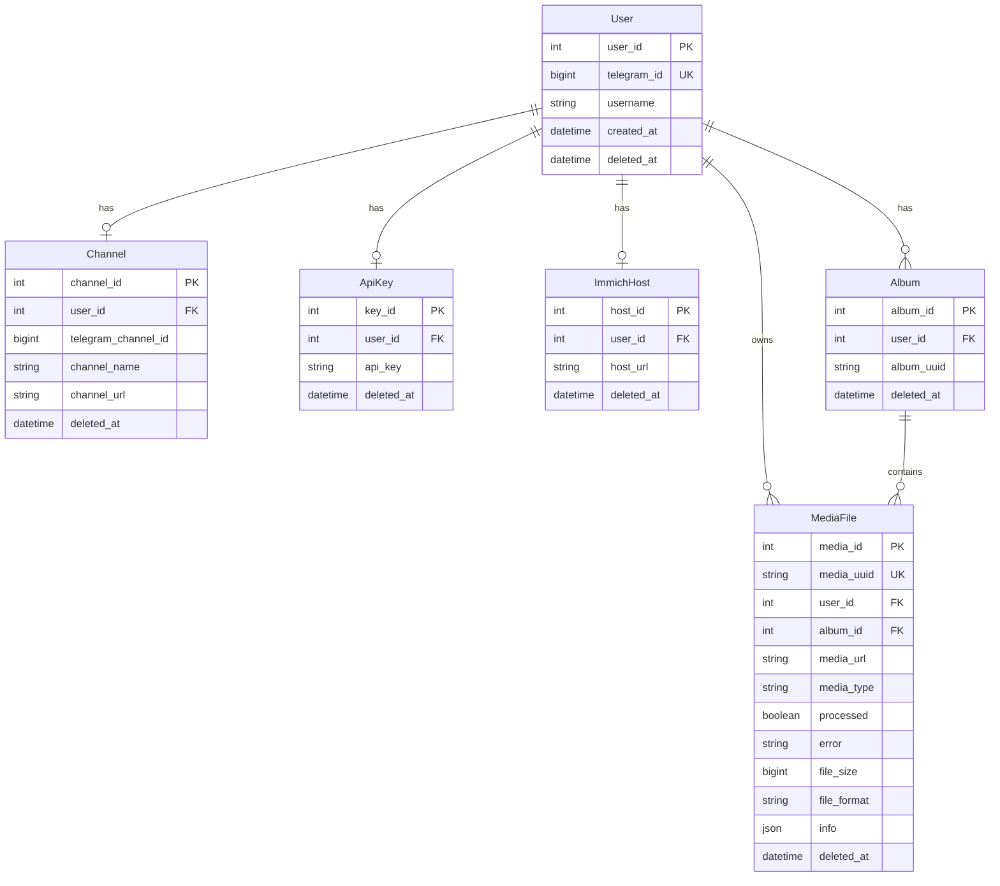
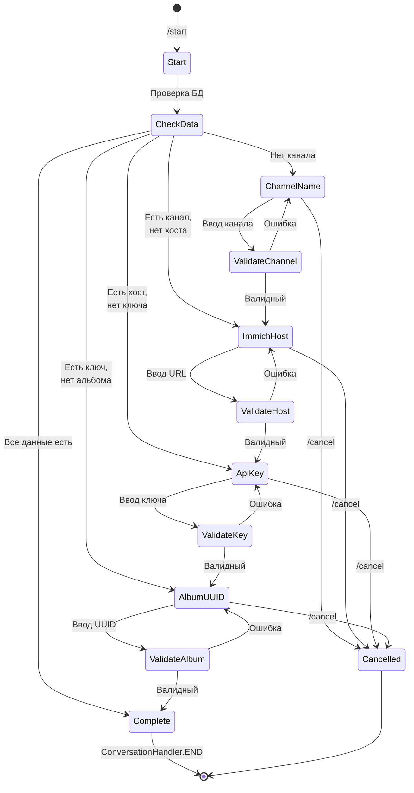
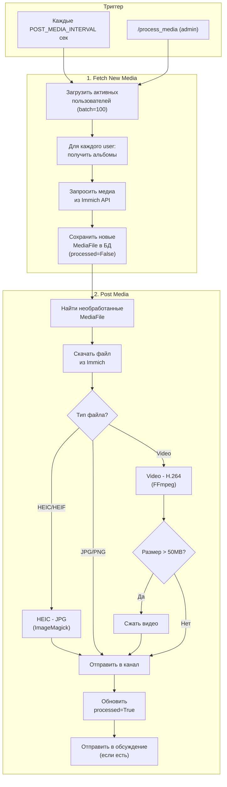
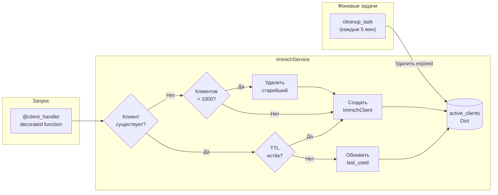
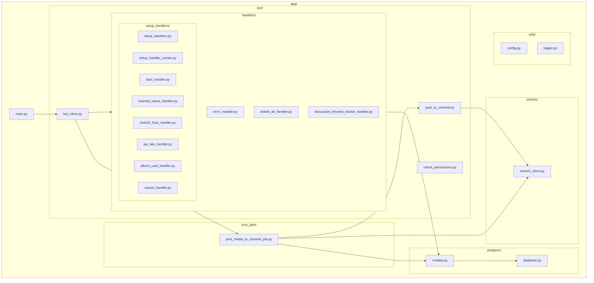
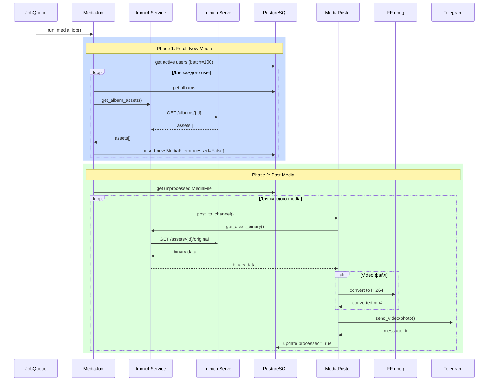

# Immich to Telegram Bot

Telegram бот для автоматической публикации медиа из альбомов Immich в Telegram каналы.

## Возможности

- Автоматическая синхронизация медиа из Immich альбомов
- Конвертация HEIC/HEIF в JPG
- Конвертация видео в H.264 (совместимость с Android)
- Автоматическое сжатие файлов > 50MB
- Извлечение EXIF метаданных для подписей
- Поддержка обсуждений каналов

## Быстрый старт

```bash
# Development
docker-compose -f docker-compose.dev.yml up --build

# Production
docker-compose up --build
```

## Переменные окружения

```env
TELEGRAM_TOKEN=your_bot_token
ADMIN_IDS=123456789,987654321
POSTGRES_USER=user
POSTGRES_PASSWORD=password
POSTGRES_HOST=localhost
POSTGRES_PORT=5432
POSTGRES_DB=immich_tg
APP_ENV=dev
POST_MEDIA_INTERVAL=3600
```

---

## Архитектура

### Общая схема системы



### ER-диаграмма базы данных



### Поток настройки бота (ConversationHandler)



### Поток обработки медиа (Cron Job)



### ImmichService - управление пулом клиентов



### Структура компонентов



### Sequence диаграмма постинга медиа



---

## Команды бота

| Команда | Описание | Доступ |
|---------|----------|--------|
| `/start` | Запуск настройки бота | Все |
| `/delete_my_data` | Удаление всех данных пользователя | Все |
| `/process_media` | Ручной запуск обработки медиа | Админы |


## Разработка

```bash
# Линтинг
ruff check app/
ruff format app/

# Миграции БД
cd app && alembic upgrade head
cd app && alembic revision --autogenerate -m "description"
```

## Лицензия

MIT
